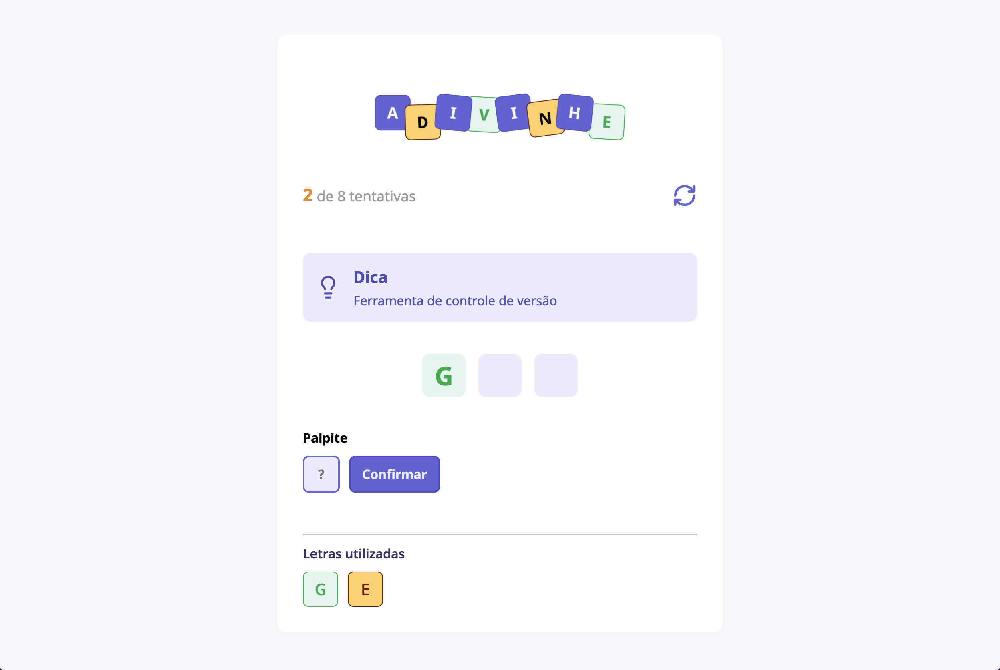
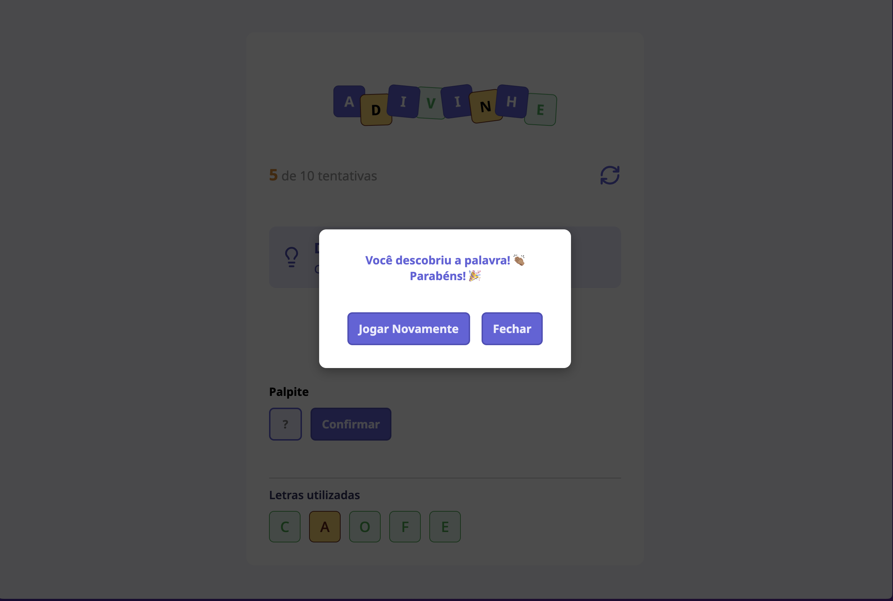

# Adivinha Aí 🎮




## Sobre o Projeto

"Adivinha Aí" é um jogo simples e divertido de adivinhação de palavras, similar ao popular jogo da forca. O objetivo é descobrir a palavra secreta adivinhando letras. Com um número limitado de tentativas, você precisa usar suas habilidades de dedução para acertar a palavra antes que suas tentativas se esgotem\!

Este projeto foi desenvolvido utilizando **React**, **TypeScript** e **CSS Modules**, focando na modularidade e organização do código.

[Confira como o jogo funciona](https://adivinhaai.vercel.app/)

---

## Funcionalidades ✨

- **Adivinhação de Palavras**: Descubra a palavra secreta letra por letra.
- **Dicas**: Cada palavra vem com uma dica para ajudar na adivinhação.
- **Contador de Tentativas**: Acompanhe suas tentativas restantes.
- **Letras Usadas**: Veja quais letras você já tentou (corretas e incorretas).
- **Reiniciar Jogo**: Opção para começar um novo jogo a qualquer momento.
- **Responsivo**: Design adaptável para diferentes tamanhos de tela.

---

## Tecnologias Utilizadas 🛠️

- **React**: Biblioteca JavaScript para construção de interfaces de usuário.
- **TypeScript**: Superset do JavaScript que adiciona tipagem estática.
- **CSS Modules**: Para modularizar e isolar estilos CSS.
- **Vite**: Ferramenta de build para desenvolvimento web moderno e rápido.

---

## Como Rodar o Projeto Localmente 💻

Siga os passos abaixo para ter o projeto "Adivinha Aí" rodando na sua máquina.

### Pré-requisitos

Certifique-se de ter o **Node.js** e o **npm** (ou yarn/pnpm) instalados em sua máquina.

### Instalação

1.  **Clone o repositório:**

    ```bash
    git clone https://github.com/anaclaraaraujo/adivinha-ai.git
    ```

2.  **Navegue até o diretório do projeto:**

    ```bash
    cd adivinha-ai
    ```

3.  **Instale as dependências:**

    ```bash
    npm install
    # ou yarn install
    # ou pnpm install
    ```

### Rodando o Servidor de Desenvolvimento

Após a instalação das dependências, você pode iniciar o servidor de desenvolvimento:

```bash
npm run dev
# ou yarn dev
# ou pnpm dev
```

O jogo estará disponível em `http://localhost:5173` (ou outra porta indicada no seu terminal).

### Construindo para Produção

Para gerar uma versão otimizada para produção:

```bash
npm run build
# ou yarn build
# ou pnpm build
```

Os arquivos de produção serão gerados na pasta `dist/`.

---

## Estrutura do Projeto 📂

A estrutura do projeto segue uma organização lógica para facilitar a manutenção e o desenvolvimento:

```
adivinha-ai/
├── public/
├── src/
│   ├── assets/
│   ├── components/       # Componentes React reutilizáveis (Button, Header, Input, etc.)
│   ├── hooks/            # Hooks personalizados (useGameLogic)
│   ├── reducer/          # Lógica do Reducer para o estado do jogo
│   ├── styles/           # Estilos globais ou para o App principal
│   ├── utils/            # Funções utilitárias (palavras do jogo)
│   ├── App.module.css    # Estilos CSS específicos do componente App
│   ├── App.tsx           # Componente principal da aplicação
│   ├── main.tsx          # Ponto de entrada da aplicação
│   └── vite-env.d.ts
├── .eslintrc.cjs
├── .gitignore
├── index.html
├── package.json
├── README.md
├── tsconfig.json
├── tsconfig.node.json
└── vite.config.ts
```

---

## Contribuição 🤝

Contribuições são bem-vindas\! Se você tiver alguma ideia ou encontrar um bug, sinta-se à vontade para:

1.  Fazer um **fork** do repositório.
2.  Criar uma **branch** para sua feature (`git checkout -b feature/minha-feature`).
3.  Fazer suas **alterações** e commitar (`git commit -m 'feat: minha nova feature'`).
4.  Fazer **push** para a branch (`git push origin feature/minha-feature`).
5.  Abrir um **Pull Request**.
